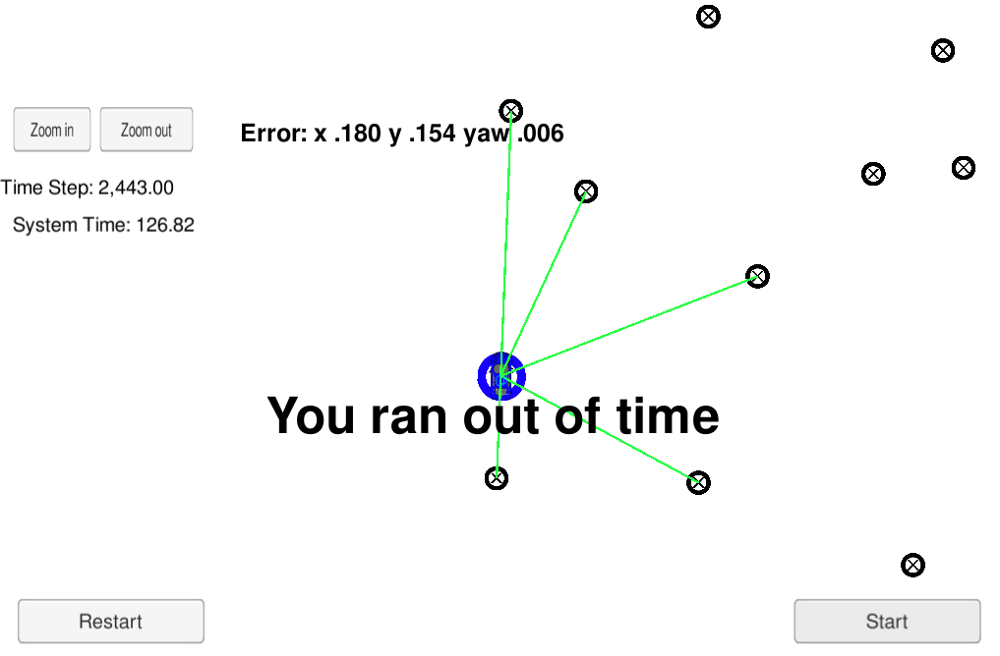
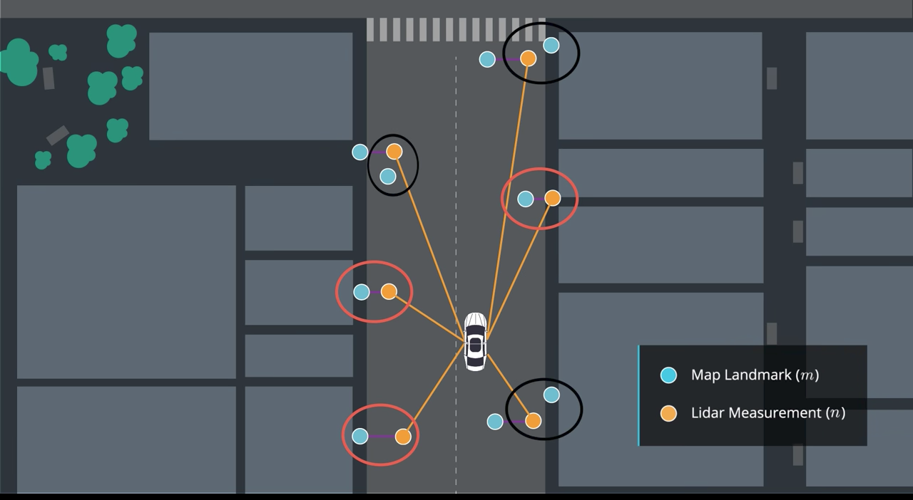

# Kidnapped Vehicle Project

## Table Content: ##
- [Objective](#objective)
- [Results](#results)
- [How to run](#howto)
- [Code](#code)
- [Directory Structure](#structure)
- [Particle Filter Input](#input)
- [Success Criteria](#criteria)
- [Localization Flow](#flow)

## Objective: <a name="objective"></a>

The goal is to find the kidnapped vehichle's new location based on map of the location, an initial GPS estimate, sensor, and control data. In this project, 2 dimensional particle filter is implemented in C++. The particle filter will be given a map and some initial localization information (analogous to what a GPS would provide). At each time step your filter will also get observation and control data.


## Results: <a name="results"></a>

Below image shows the final result of the project. However, performance criteria,  completing less than 100 seconds, not met due to poor graphic perfromance. Discussion forums state that this issue has been seen and it is recommended to move forward with the submission.

https://discussions.udacity.com/t/you-ran-out-of-time-when-running-with-the-simulator/269900/19
https://discussions.udacity.com/t/you-ran-out-of-time-error-what-to-do/319164




## How to run: <a name="howto"></a>

This project involves the Term 2 Simulator which can be downloaded [here](https://github.com/udacity/self-driving-car-sim/releases)

This repository includes two files that can be used to set up and intall uWebSocketIO for either Linux or Mac systems. For windows you can use either Docker, VMware, or even Windows 10 Bash on Ubuntu to install uWebSocketIO.

Once the install for uWebSocketIO is complete, the main program can be built and ran by doing the following from the project top directory.

	mkdir build
	cd build
	cmake ..
	make
	./particle_filter
	
## Code: <a name="code"></a>

The code, src/particle_filter.cpp, will be modified and src/main.cpp doesn't need modification. 

INPUT: values provided by the simulator to the c++ program

// sense noisy position data from the simulator

["sense_x"] 

["sense_y"] 

["sense_theta"] 

// get the previous velocity and yaw rate to predict the particle's transitioned state

["previous_velocity"]

["previous_yawrate"]

// receive noisy observation data from the simulator, in a respective list of x/y values

["sense_observations_x"] 

["sense_observations_y"] 


OUTPUT: values provided by the c++ program to the simulator

// best particle values used for calculating the error evaluation

["best_particle_x"]

["best_particle_y"]

["best_particle_theta"] 

//Optional message data used for debugging particle's sensing and associations

// for respective (x,y) sensed positions ID label 

["best_particle_associations"]

// for respective (x,y) sensed positions

["best_particle_sense_x"] <= list of sensed x positions

["best_particle_sense_y"] <= list of sensed y positions


Your job is to build out the methods in `particle_filter.cpp` until the simulator output says:

	Success! Your particle filter passed!


All you will submit is your completed version of `particle_filter.cpp`, which is located in the `src` directory. You should probably do a `git pull` before submitting to verify that your project passes the most up-to-date version of the grading code (there are some parameters in `src/main.cpp` which govern the requirements on accuracy and run time.)

 
## Directory Structure <a name="structure"></a>
The directory structure of this repository is as follows:

```
root
|   CMakeLists.txt
|   cmakepatch.txt
|   README.md
|   *.sh
|
|___images
|   |
|   |  kvp_result.png
|
|
|___data
|   |   
|   |   map_data.txt
|   
|   
|___src
    |   helper_functions.h
    |   main.cpp
    |   map.h
    |   particle_filter.cpp
    |   particle_filter.h
```

## Particle Filter Input <a name="input"></a>
You can find the inputs to the particle filter in the `data` directory. 

### The Map
`map_data.txt` includes the position of landmarks (in meters) on an arbitrary Cartesian coordinate system. Each row has three columns
1. x position
2. y position
3. landmark id

## Success Criteria <a name="criteria"></a>
If your particle filter passes the current grading code in the simulator (you can make sure you have the current version at any time by doing a `git pull`), then you should pass! 

The things the grading code is looking for are:


1. **Accuracy**: your particle filter should localize vehicle position and yaw to within the values specified in the parameters `max_translation_error` and `max_yaw_error` in `src/main.cpp`.

2. **Performance**: your particle filter should complete execution within the time of 100 seconds.

## Localization Flow <a name="flow"></a>

The iterative steps to use the particle filter algorithm to track the car position within a global map from a noisy GPS position are described as followed


1. Initialize the car position for all particles. If already initialized, predict the vehicle's next state plus all the particles from the previous data and estimated speed and yaw rate.
2. Receive landmark observations data from the simulator.
3. Update the particle weights and resample particles.
4. Calculate and output the average weighted error of the particle filter over all time steps so far.


In Step 1, beside initializing the car position, we also need to initialize the particles around the GPS-identified position with a predefined Gaussian distribution for x, y positions and orientation. Once initialized, we predict the next position of our car and the particles using time, velocity and yaw rate. Remember to check if the yaw rate is too small to avoid Number Overflow.

For Step 3, let's look at how particles, acting as satellites around the car, evolves to estimate the locations of surrounding landmarks.



First, in order to relate particles to the global map, one needs to transform the particle positions observed by the car into particle positions in the global map. This can be done with coordinate transformation and rotation. Second, we want to know which landmark a particular particle is observing by finding the shortest distance from all landmarks to the particle. Certainly, if we know the sensor range of our car, we can narrow down the search to only localized landmarks near the car. Third, we want to ask ourselves, how much we can trust each particle. The weightage is done by comparing how close each particle can estimate its landmarks.

Now, another important thing we need to do in Step 4 is resampling particles based on their weights. This means we resample with replacement based on the particle weights. Accurate particles will survive and inaccurate ones will be removed. So the number of particles still stay the same, but their positions will scatter off due to the Gaussian error we introduce in every prediction step in Step 1.
